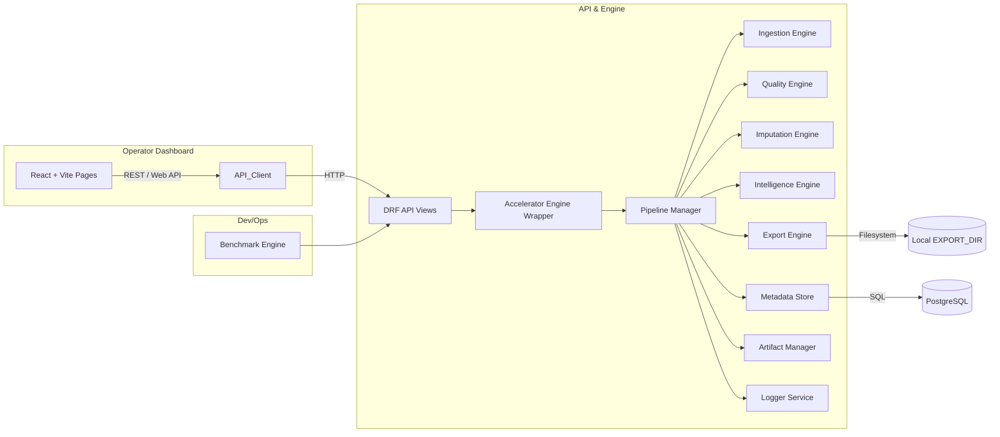

# Database Accelerator

Comprehensive project documentation for the Database Accelerator repository.

---

## Overview

Database Accelerator is a modular data preparation and analysis platform designed for operators and data engineers to rapidly register, profile, clean, benchmark, and export tabular datasets. It provides:

- A modular backend (Django + DRF) with separate ingestion, quality, imputation, intelligence, export, logging, and benchmark engines.
- A professional operator dashboard (React + Vite) for dataset management, execution telemetry, benchmark monitoring, and artifact delivery.
- A benchmarking harness for synthetic and edge-case datasets to validate performance, resilience, and artifact generation.

The system emphasizes reproducible artifact outputs, operator-grade controls, and explicit metadata tracking; the canonical artifacts produced per dataset run are:

- `clean_dataset.csv` — cleaned & deduplicated tabular data
- `quality_report.pdf` — a human-readable PDF summarizing data quality and actions
- `removed_columns.json` — list of columns dropped during preprocessing
- `imputation_log.json` — details of imputation decisions and statistics
- `feature_summary.txt` — text summary of final features and statistics
- `recommended_model_input.csv` — a modeling-ready CSV (feature-selected & encoded)

These artifacts are exported to the configured `EXPORT_DIR` for downstream use while metadata is persisted through the storage abstraction.

---

## Key Design Goals

- Operator-first experience: clear KPIs, artifact links, and execution logs.
- Robustness: handles edge cases including very-wide datasets, heavy missingness, mixed types, nested JSON columns, and unicode anomalies.
- Performance-aware: scale-aware heuristics in expensive stages (pattern discovery, MI/correlation) and benchmark-driven optimizations.
- Reproducibility: artifact generation and stage timings captured for auditing.

---

## Repository Structure (top-level)

- `backend/` — Django project and apps.
  - `database_accelerator/apps/api_gateway/accelerator_engine.py` — thin orchestrator entry point.
  - `database_accelerator/apps/engines/` — modular pipeline engines.
    - `ingestion_engine/` — reader, normalizer, validator.
    - `quality_engine/` — missing analyzer, duplicate detector, outlier detector, profiling.
    - `imputation_engine/` — strategy selector, imputers, logger.
    - `intelligence_engine/` — correlation, mutual information, feature selection, recommender.
    - `export_engine/` — CSV, PDF, JSON, and summary exporters.
    - `benchmark_engine/` — edge-case generators and benchmark runner.
  - `database_accelerator/apps/storage/` — metadata abstraction, Postgres adapter, metadata manager.
  - `database_accelerator/apps/artifacts/` — artifact registry and version tracking.
  - `database_accelerator/apps/logging/` — pipeline, stage, and benchmark logs.
  - `database_accelerator/apps/upload_module/` — dataset registration compatibility manager.
  - `scripts/` — utilities and benchmark harness.
    - `accelerator_benchmark.py` — benchmark runner entry point.
- `frontend/` — React + Vite operator dashboard.
  - `src/pages/` — dashboard, upload, dataset, benchmark, and artifact pages.
  - `src/components/` — KPI, execution console, dataset card, artifact viewer, pipeline status, benchmark charts.
  - `src/services/` — module-specific API wrappers.
- `README.md` — quickstart and high-level notes.
- `DATABASE_ACCELERATOR_DOCUMENTATION.md` — (this file) full project documentation.

---

## Modules and Responsibilities

### Backend

- `api_gateway/accelerator_engine.py`
  - Thin compatibility wrapper that exposes `run_accelerator_pipeline()`.
  - Delegates execution to the pipeline manager and keeps the public API stable.

- `engines/pipeline_manager.py`
  - Central coordinator for stage execution.
  - Responsibilities:
    - stage sequencing
    - timing collection
    - failure recovery and logging
    - metadata updates
    - export orchestration

- `engines/ingestion_engine/`
  - `reader.py` loads CSV, XLSX, XLS, and JSON datasets.
  - `normalizer.py` standardizes column naming and frame shape.
  - `validator.py` performs baseline validation.

- `engines/quality_engine/`
  - `missing_analyzer.py` measures missingness and health.
  - `duplicate_detector.py` identifies duplicates and duplicate rate.
  - `outlier_detector.py` evaluates numeric outliers.
  - `profiling.py` builds dataset profiles.

- `engines/imputation_engine/`
  - `strategy_selector.py` chooses adaptive imputation strategies.
  - `imputers.py` applies the selected imputations.
  - `logger.py` builds structured imputation logs.

- `engines/intelligence_engine/`
  - `correlation.py` computes correlation pairs.
  - `mutual_information.py` computes bounded MI pairs.
  - `feature_selector.py` scores features.
  - `recommender.py` creates model-ready input.

- `engines/export_engine/`
  - `csv_exporter.py`, `pdf_exporter.py`, `json_exporter.py`, `summary_writer.py` generate and write artifacts.

- `storage/`
  - `metadata_store.py` exposes the metadata abstraction.
  - `postgres_manager.py` coordinates metadata operations.
  - `postgres_adapter.py` handles the SQL-backed metadata persistence layer.

- `artifacts/artifact_manager.py`
  - Registers generated artifacts, validates outputs, and tracks versions.

- `logging/logger_service.py`
  - Records pipeline, stage, and benchmark events.

- `engines/benchmark_engine/`
  - `edge_generator.py` creates benchmark datasets.
  - `benchmark_runner.py` runs the suite and captures timings.

- `upload_module/models.py`
  - Compatibility dataset manager that routes dataset registration and updates through the metadata store.

### Frontend (Operator Dashboard)

- `pages/DashboardPage.jsx` — main operator dashboard with KPI tiles, stage status, dataset cards, execution console, and artifact registry.
- `pages/UploadPage.jsx` — upload and execution workspace.
- `pages/DatasetPage.jsx` — dataset drill-down entry point.
- `pages/BenchmarkPage.jsx` — benchmark monitoring entry point.
- `pages/ArtifactPage.jsx` — artifact registry and download entry point.
- `components/` — reusable dashboard sections for KPIs, execution logs, dataset cards, artifact links, pipeline status, and benchmark metrics.
- `services/` — module-specific wrappers for datasets, pipeline runs, benchmarks, and artifacts.

---

## Architecture

Below is the current modular architecture. The diagram focuses on component boundaries and operational responsibilities rather than internal implementation details.



Notes on architecture choices:

- Large dataset files and generated artifacts live in `EXPORT_DIR`.
- Metadata is routed through the metadata abstraction and persisted via the SQL-backed adapter.
- The orchestrator is intentionally thin; stage behavior belongs to the engine modules.
- The benchmark system exercises the same pipeline surface as production runs and feeds observability and performance analysis.

---

## Data Flow

UPLOAD → Dataset Registration → Metadata Creation → Ingestion → Normalization → Quality Profiling → Missing Analysis → Imputation → Duplicate Removal → Noise Cleaning → Feature Intelligence → Feature Selection → Model Dataset Creation → Artifact Generation → Dashboard Display → Export

Each stage is executed by the pipeline manager, timed, logged, and written to the execution and artifact registry outputs.

---

## API Endpoints (high-level)

These endpoints are implemented as DRF views (examples):

- `POST /api/datasets/` — register/upload a new dataset
- `GET /api/datasets/` — list datasets and metadata
- `GET /api/datasets/{id}/` — dataset details and artifacts
- `POST /api/datasets/{id}/run-accelerator/` — trigger a pipeline run and return artifact links + timings
- `GET /api/datasets/{id}/artifacts/{artifact_name}` — download artifact
- `GET /api/benchmark/results/` — (scripts endpoint) access benchmark reports

Refer to the backend `views` and `serializers` for exact parameter names and payload shapes.

---

## Running Locally (Developer Quickstart)

Prerequisites

- Python 3.10+ (virtualenv recommended)
- Node.js 18+ and npm or yarn
- Git

Backend

1. Create and activate a virtual environment:

```powershell
python -m venv venv
venv\Scripts\Activate.ps1
```

2. Install dependencies (from the repo root):

```powershell
pip install -r backend/requirements.txt
```

3. Set EXPORT_DIR in `backend/settings.py` or as an env var to a writable folder.

4. Run Django migrations and start the API server:

```powershell
cd backend
python manage.py migrate
python manage.py runserver
```

Frontend

1. Install packages and start the dev server:

```bash
cd frontend
npm install
npm run dev
```

2. Open the dashboard at the dev URL (Vite prints it to console; typically `http://localhost:5173`).

Benchmarking

1. From the backend root run the benchmark script:

```powershell
python backend/scripts/accelerator_benchmark.py --output backend/scripts/benchmark_results_edgecases.json
```

2. Review generated JSON files for stage timings and pass metrics.

---

## Performance & Scaling Notes

- Pattern discovery (pairwise correlation / mutual information) is bounded through priority-column selection for very-wide datasets.
- DataFrame fragmentation is avoided in benchmark dataset generation by bulk column creation and frame copying.
- CSV artifact writes may dominate runtime for very large row counts; streaming or chunked writes remain a recommended optimization.
- Stage timing, benchmark timing, and log outputs are now first-class artifacts.

---

## Testing & Validation

- Unit tests: add tests under `backend/tests/` to validate individual pipeline stages and edge-case behaviors.
- Integration tests: the benchmark harness acts as an integration validator across the full stack.
- CI: recommended to run benchmark smoke tests on PRs that change pipeline logic.
- Dashboard validation: verify the dashboard routes and cards render after frontend changes.

---

## Troubleshooting

- If `DataFrame is highly fragmented` warnings appear: ensure synthetic generator or upstream data creation avoids repeated `insert()`; use `pd.concat` + `copy()`.
- If pattern discovery is slow on wide inputs: verify the engine is using the configured priority threshold and the benchmark inputs are not excessively wide.
- If artifact links fail: confirm `EXPORT_DIR` is writable and the metadata store points to a working database connection.
- If the dashboard shows blank pages: confirm the router includes the new dashboard, dataset, benchmark, and artifact routes.

---

## Contributing

- Follow the repository's coding conventions and run linters before submitting PRs.
- Describe performance implications for changes to pipeline stages.
- Add or update benchmark specs when adding support for new edge-case data shapes.

---

## Appendix

- Artifacts produced per run (names): `clean_dataset.csv`, `quality_report.pdf`, `removed_columns.json`, `imputation_log.json`, `feature_summary.txt`, `recommended_model_input.csv`.
- Important files:
  - `backend/database_accelerator/apps/api_gateway/accelerator_engine.py`
  - `backend/database_accelerator/apps/engines/pipeline_manager.py`
  - `backend/database_accelerator/apps/storage/metadata_store.py`
  - `backend/database_accelerator/apps/logging/logger_service.py`
  - `backend/scripts/accelerator_benchmark.py`
  - `frontend/src/pages/DashboardPage.jsx`
  - `frontend/src/pages/UploadPage.jsx`
  - `frontend/src/components/ExecutionConsole/ExecutionConsole.jsx`

- Benchmark outputs produced by the engine and script:
  - `benchmark_report.json`
  - `benchmark_summary.pdf`

---

If you'd like, I can also:
- Add a dedicated `architecture/` folder with SVG/PNG diagrams.
- Generate a smaller `QuickStart.md` specialized for operators (one-page runbook).
- Expand the API section with exact request/response examples drawn from the running server.

